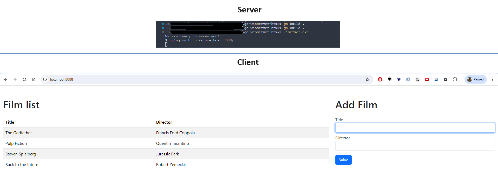

# go-webserver-htmx
Simple GoLang project to create a web server and create htmx page and check POST and GET methods

This project was build using GoLang version *go1.23.0*

## How to build
To build the project you must run `go build .`

## How to run
After build the project the _**server**_ file will be generated and you can excute this file on terminal. `> ./server`

## Preview
